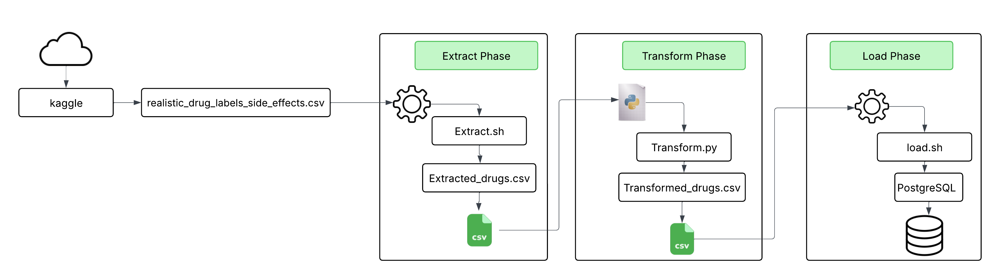

# 🧪Linux-Based ETL Pipeline with PostgreSQL

## 📌 Project Intent
This project simulates a basic ETL pipeline using Linux shell scripting, Python for data transformation, and PostgreSQL for data storage and analytics. It’s designed to showcase beginner-level data engineering skills.

## 🔍 What is ETL?

**ETL** stands for **Extract, Transform, Load** a foundational process in data engineering used to move and prepare data from one system to another.

## 🧭 Workflow
- **Extract**: Pull raw data from a source (e.g., CSV files, APIs, databases)
- **Transform**: Clean, format, and enrich the data to make it usable
- **Load**: Insert the transformed data into a target system (e.g., a database)

In this project, applied the ETL process to a Kaggle dataset on drug labels and side effects. Each phase is scripted and documented to help others understand how data flows from raw files to structured tables.

## 📁 Project Structure

- `scripts/`: Contains shell and Python scripts for each ETL phase  
- `data/`: Stores raw, extracted, and transformed CSV files  
- `docs/`: Phase-wise documentation with commands, logic, and output
- `docs/Linux_ETL_Pipeline_WORKFLOW.png`: Visual overview of the pipeline

## 🛠️ Tech Stack
- Linux (Ubuntu)
- Shell scripting (`bash`)
- Python (`pandas`)
- PostgreSQL
---

## 🚀 ETL Workflow Overview

| Phase         | Tool(s) Used                  | Output File(s)              |
|---------------|-------------------------------|-----------------------------|
| Extract       | `extract.sh`, `extract.py`    | `extracted_drugs.csv`       |
| Transform     | `transform.py`                | `transformed_drugs.csv`     |
| Load          | `load.sh`, `database.sql`     | PostgreSQL `drugdb → drugs` |

---

## 📚 Documentation
Each phase is documented in detail:

- [Extract Phase](docs/Extract_Phase.md)  
- [Transform Phase](docs/Transform_Phase.md)  
- [Load Phase](docs/Load_Phase.md)
---

## 🖼️ Visual Reference

